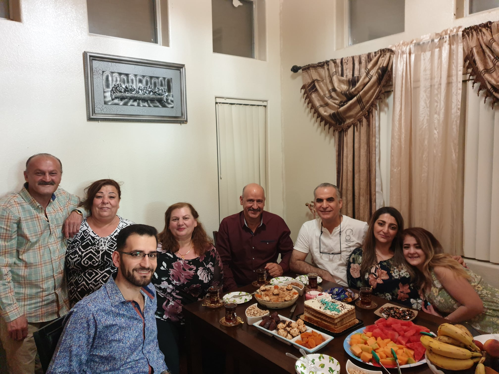

import YouTube from "@components/YouTube/YouTube.jsx";
import Gallery from "@components/Gallery/Gallery.jsx";
import hmove1 from './images/hmove1.jpg'
import hmove2 from './images/hmove2.jpg'
import hmove3 from './images/hmove3.jpg'
import hmove4 from './images/hmove4.jpg'
import hmove5 from './images/hmove5.jpg'
import hmove6 from './images/hmove6.jpg'
import hmove7 from './images/hmove7.jpg'
import hmove8 from './images/hmove8.jpg'
import hmove9 from './images/hmove9.jpg'
import outdoor1 from "./images/outdoor1.jpg";
import outdoor2 from "./images/outdoor2.jpg";
import outdoor3 from "./images/outdoor3.jpg";
import outdoor4 from "./images/outdoor4.jpg";
import outdoor5 from "./images/outdoor5.jpg";
import outdoor6 from "./images/outdoor6.jpg";
import outdoor7 from "./images/outdoor7.jpg";
import outdoor8 from "./images/outdoor8.jpg";
import outdoor9 from "./images/outdoor9.jpg";
import outdoor10 from "./images/outdoor10.jpg";
import outdoor11 from "./images/outdoor11.jpg";
import outdoor12 from "./images/outdoor12.jpg";
import outdoor13 from "./images/outdoor13.jpg";
import outdoor14 from "./images/outdoor14.jpg";
import outdoor15 from "./images/outdoor15.jpg";
import outdoor16 from "./images/outdoor16.jpg";
import outdoor17 from "./images/outdoor17.jpg";
import outdoor18 from "./images/outdoor18.jpg";
import outdoor19 from "./images/outdoor19.jpg";
import outdoor20 from "./images/outdoor20.jpg";
import outdoor21 from "./images/outdoor21.jpg";
import outdoor22 from "./images/outdoor22.jpg";
import outdoor23 from "./images/outdoor23.jpg";
import outdoor24 from "./images/outdoor24.jpg";
import outdoor25 from "./images/outdoor25.jpg";
import fun1 from "./images/fun1.jpg";
import fun2 from "./images/fun2.jpg";
import fun3 from "./images/fun3.jpg";
import fun4 from "./images/fun4.jpg";
import fun5 from "./images/fun5.jpg";
import fun6 from "./images/fun6.jpg";
import fun7 from "./images/fun7.jpg";
import fun8 from "./images/fun8.jpg";
import fun9 from "./images/fun9.jpg";
import fun10 from "./images/fun10.jpg";
import fun11 from "./images/fun11.jpg";
import fun12 from "./images/fun12.jpg";
import fun13 from "./images/fun13.jpg";
import fun14 from "./images/fun14.jpg";
import fun15 from "./images/fun15.jpg";
import fun16 from "./images/fun16.jpg";
import fun17 from "./images/fun17.jpg";
import fun18 from "./images/fun18.jpg";
import fun19 from "./images/fun19.jpg";
import fun20 from "./images/fun20.jpg";
import fun21 from "./images/fun21.jpg";
import fun22 from "./images/fun22.jpg";
import fun23 from "./images/fun23.jpg";
import fun24 from "./images/fun24.jpg";
import fun25 from "./images/fun25.jpg";
import fun26 from "./images/fun26.jpg";
import fun27 from "./images/fun27.jpg";
import fun28 from "./images/fun28.jpg";
import am1 from "./images/am1.jpg";
import am2 from "./images/am2.jpg";
import am3 from "./images/am3.jpg";
import am4 from "./images/am4.jpg";
import am5 from "./images/am5.jpg";
import am6 from "./images/am6.jpg";
import am7 from "./images/am7.jpg";
import am8 from "./images/am8.jpg";
import am9 from "./images/am9.jpg";
import am10 from "./images/am10.jpg";
import am11 from "./images/am11.jpg";
import cam1 from "./images/cam1.jpg";
import cam2 from "./images/cam2.jpg";

## Introduction
2021 another busy year... Luckily, this time we were able to meet people and go outside thanks to the vaccine. This year can be summed up as the year of new things! New home, new city, new experiences, new status and new challenges to overcome. Of course, it was not all work and challenges! There was a lot of fun included as well.

<Gallery photos={[
    fun1,
    fun2,
    fun3,
    fun4,
    fun5,
    fun6,
    fun7,
    fun8,
    fun9,
    fun10,
    fun11,
    fun12,
    fun13,
    fun14,
    fun15,
    fun16,
    fun17,
    fun18,
    fun19,
    fun20,
    fun21,
    fun22,
    fun23,
    fun24,
    fun25,
    fun26,
    fun27,
    fun28,
]} />
 

## Goals achieved this year
###  Major Life goals
#### Develop a financial roadmap
The main reasons for having the roadmap are to ensure I know what I am working towards to and where I am at in the progress. I leveraged multiple tools and research available to develop this roadmap. Some of the main components are: [the average networth calculation](https://www.thesimpledollar.com/financial-wellness/what-should-your-net-worth-be-why-the-millionaire-next-door-equation-falls-short-and-what-a-better-thumbnail-calculation-might-look-like/), [The 4% rule for retirement](https://www.thebalance.com/dont-confuse-these-two-retirement-rules-of-thumb-453920), [US inflation calculator](https://www.usinflationcalculator.com/) and many other undocumented articles. 

**To summarize**:
- In thirties, should prioritize paying off any debt that is 5% or more. Have a will, life insurance, disability insurance, 1.5 years of expenses invested and 1.2 years of income saved.
- In forties, should prioritize paying off any debt that is 4% or more. Update will, life insurance, disability insurance, ensure investments and savings are growing appropriately to match and meet the target retirement amount/timeline. Ideally lay out the foundation for [FatFire](https://www.financialsamurai.com/what-is-fat-fire-best-way-to-retire-early/).
- In fifties, should eliminate all debt, ensure will, estate documents and all legal work is in a good state. Develop a retirement plan, what you are retiring into! Don't count on social security, since the program is running out of funding and uncle sam can change everything anytime.
 
#### Buy a second house
This year was when I finally closed on the Henderson home. This is the home that we purchased as a customized new build. Although, we customized it and it was brand new, we still did a ton of work on it. There were many projects that we did to turn the house into our home.

#### Have multiple streams of income
By moving to Henderson, I was able to rent our home in El Cajon. By doing so, I managed to have another stream of income. Although, the stream is pretty small right now since most of the rent is going back into the house expenses itself. But overtime the stream will grow and help covers some bills.
 
#### Become a startups investor
I have joined a couple venture funds and set up my investor account with [AngelList](https://angel.co/invest/start). I have only made a very small investment as of right now. This is due to the fact that I am still learning how to invest in startups and I didn't have the extra money to invest.

#### Get mentioned in a major news outlet
I got mentioned by name and had my picture included on [Techcrunch](https://techcrunch.com/2021/03/03/after-200-arr-growth-in-2020-coursekey-raises-9m-to-digitize-trade-schools/). The article was our Series B raise announcement to highlight what we have accomplished and what we intend to do in the future.

### Yearly Goals
// TODO revisit target and plan for crypto
#### Increase my crypto investment
Since 2017, after I sold majority of my crypto, I have been out of the crypto market. This year, I went back and started investing in it again. Although, I am at a loss (bought around the peak of the market), I do believe it will grow and potentially be a good investment. My target for crypto investments is to be a total of 5% of my networth, at the beginning of the year it was ~1.5%, at peak it was closer to ~4.5% now it is at ~3%

#### Grow the CourseKey engineering team
As we raised series B, we finally had the budget to scale the team to keep up with the product demand. We hired a VP of Engineering as well as many new engineers! As of right now, the engineering team consists of 24 team members distributed across the globe.

 

### Projects
#### Home projects
With moving to a new places come a lot of projects to work on. Some of them are expected others are not so much. On top of having to unpack and organize everything in the new place, we had to assemble new furniture, install ceiling fans, decorate the house, setup garage cabinets and replace ceiling lights! This list excludes the projects that we paid people to do such us adding backsplash to the kitchen, painting the garage, epoxying the floor, sealing granite and tile and probably a few more that I am forgetting.  

<Gallery photos={[
    hmove1,
    hmove2,
    hmove3,
    hmove4,
    hmove5,
    hmove6,
    hmove7,
    hmove8,
    hmove9,
]} />

#### Outdoor projects
Once we were done with the inside of the home, we started working on things outside. Mainly fixing/cleaning up the backyard. We turned it from a deserted wasteland into a beautiful space to relax in (when the heat is not 100 degrees out). Some of those projects included cleaning up, flattening the ground, getting rocks for decorations, installing pavers, plant some greenery, install synthetic grass, install backyard lights/ decorations and set up a gazebo.

<Gallery photos={[
    outdoor1,
    outdoor2,
    outdoor3,
    outdoor4,
    outdoor5,
    outdoor6,
    outdoor7,
    outdoor8,
    outdoor9,
    outdoor10,
    outdoor11,
    outdoor12,
    outdoor13,
    outdoor14,
    outdoor15,
    outdoor16,
    outdoor17,
    outdoor18,
    outdoor19,
    outdoor20,
    outdoor21,
    outdoor22,
    outdoor23,
    outdoor24,
    outdoor25,
]} />

#### Upgraded home network
By moving to a new bigger home that meant I needed to upgrade the WiFi network as well as how my home devices connect to the internet. I set up the new router and home network so everything at home is connected and communicating properly.

#### Single sign on (SSO)
Although this was for CourseKey, I spent quite a bit of my time thinking about it and working on it. The actual project was not as challenging, the biggest issue was finding an identify provider to be able to test and verify things are working properly. This basically will allow us to authenticate users using any third party that supports the identity standards suchs as OAuth2.

#### Security system
As soon as we installed the [Lorex smart doorbell](https://www.lorextechnology.com/hd-wifi-security-camera/2k-qhd-wired-video-doorbell-with-person-detection/B451AJD-E-1-p), we fell in love with it! It worked great and gave us ease of mind and the ability to answer the door from anywhere! That got me curious about installing a full security system. So I bought a LOREX security system from costco that was a great deal for a six cameras. However, given that I don't have the tools to get the cables through the walls or a ladder tall enough to get into the attic, I hired an electrician. I helped him instead of bringing a crew and even with that and the discount it cost as much as the system it self to get it installed. 

On the plus side, I own the system and I wont have to pay anything anymore. However, after the system was installed and things got connected, I realized there was an adapter missing. After many calls and months of working with customer service, I gave up and bought the adapter. Finally, I was able to complete the system install, upgrade it and power all the cameras. 

<Gallery photos={[
    cam1,
    cam2,
]} />

### Reading Materials this year

### Podcasts

### Cities visited

<iframe src="https://www.google.com/maps/d/u/0/embed?mid=1_ba5mIDueT-DRxFNz4e7sVKm3a0PFqBQ" width="640" height="480"></iframe>

### Financial state

### Mood summary

### Activity Summary
| Activity      | Count | description |
| ----------- | ----------- | ---- |
| Work | 289 | Spend at least one hour working on CourseKey. Note: there are only [262 work days in 2020](https://hr.uiowa.edu/pay/payroll-services/payroll-calendars/working-day-payroll-calendar-2020#:~:text=There%20are%20a%20total%20of,in%20the%202020%20calendar%20year.). |

## Month by month highlights
### January
The year started with a bang! Literally right after midnight, I deployed a new update for CourseKey and things did not go as planned! The deployment took down part of the system which meant it was fire fighting mode for a few hours to get everything up and running.

As the month progressed, my family and I started planning our move and preparing for it. We started selling the extra stuff we had, packing the things we didn't need and listed our home for renting.

Before the month ended, I joined San Diego Venture Partners which later got rebranded to be [Interlock Capital](https://interlock.capital/). This gives me the exposure and the opportunity to invest in other startups. As of June, I have not made any investments, since I have no extra cash. All of my money got tied up in the new home. 

### February
This month was mostly focused on preparing for the move to Las Vegas. We rented our El Cajon home and had that all sorted out. Before leaving San Diego, I tried catching up with as many people as possible (while still in lockdown). I managed to see some friends and even get food together!

### March
The month where things finally started to fall into place! We finally were able to announce [our series B raise for CourseKey](https://techcrunch.com/2021/03/03/after-200-arr-growth-in-2020-coursekey-raises-9m-to-digitize-trade-schools/). The new home closed and we are able to move. It took an extra three months for the house to get completed due to all the COVID related delays. Once we moved in, the new home work and projects started and would last for another three months.

### April
A new quarter, which means it was time for our CourseKey quarterly meeting and kickoff. For the meeting, I attended in person in San Diego. It was a super quick visit! I was in San Diego for less than 48 hours. I got to see my coworkers, some familiar faces as well as new ones.  

Being in a new city, means there is a lot exploration and places to go to and see. Along with exploring and visiting the places, we got to meet new people and make new friends.

I joined another venture capitalist fund called [305 ventures](https://www.305.ventures/). Additionally, I set up my investor account with [AngelList](https://angel.co/invest/start). I was not only growing my involvement in startups via investing but also by giving back. I did an industry panel for [Lambda school](https://lambdaschool.com/) as well trying getting in touch with [StartupNV](https://startupnv.org/).

### May
The house projects somehow keep coming out of nowhere! While continuing to work on those projects, we still managed to enjoy the scenery of Las Vegas area before the heat hit.   

Before the month ended, I planned a trip to San Diego. The main reason was to attend my cousin's event and meet the rest of wedding party gang! During my visit, I got to finally see some friends that I have not seen since pre-covid. 

### June
This month was mostly for recovery and catching up on the things I kept pushing while working on the home projects. I finally applied and got the TSA pre✔. That will allow me to get through security much faster and avoid having to take off my belt and shoes. 

Additionally, I took some time to find new doctors and scheduled appointments for all sorts of things. I also had a super minor cosmetic surgery to get rid of the weird zit on the side of my head.

### July
What a crazy month! I did not only have ton of work but also trips to San Diego! Not a single trip but actually two different trips! The first trip was for my cousin's [henna party](https://culturalglimpse.com/2014/10/21/the-blessings-of-a-henna-party/) and wedding!

<Gallery photos={[
    am1,
    am2,
    am3,
    am4,
    am5,
    am6,
    am7,
    am8,
    am9,
    am10,
    am11,
]} />

### August

### September

### October

### November

### December
