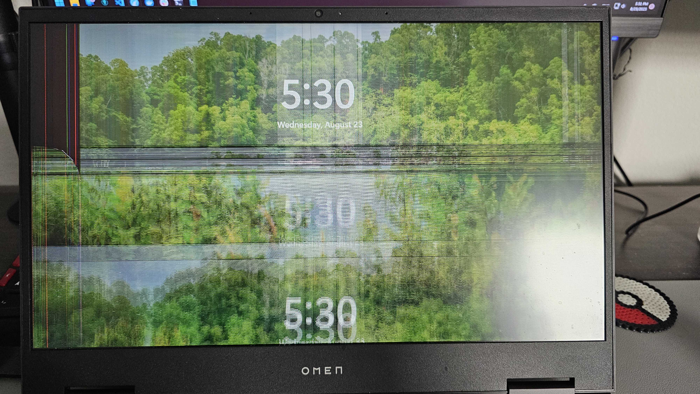

import YouTube from "@components/YouTube/YouTube.jsx";
import Gallery from "@components/Gallery/Gallery.jsx";
import Instagram from "@components/Instagram/Instagram.jsx";
// mport remote1 from './images/remote1.jpg'

## Introduction

## Goals achieved this year
### Complete the estate plan
Last year I got the plan together and started working through it. This year I am wrapped things up. I dealt with the big complex items such us dealing with treasury and California property. Almost everything is now owned by my trust protecting and shielding it from probate. The only remaing asset that needs to be transfered is a startup investment through a fund directly. 

## Projects
### Health and Fitness
I thought I was doing good on my health until I went to my new primary care doctor with the latest labs. It turned out I don't have near enough muscle mass that I should to support my body. All the work from home has taken a toll on my body. I am now working on building muscle mass and getting back in shape. I am also working on improving my diet and eating habits. Since then I have gotten more active and have been taking care of my body more. I have enrolled in a gym and I have been sneaking into my sister's work to use thier inbody machine which gives a breakdown of muscle mass, fat mass and water mass. I have been tracking my progress and I am happy to say I have been making progress. I have been able to increase my muscle mass and decrease my fat mass. I am still not where I want to be but I am getting there.
### Parents health
My parents health hasnt been the best. My mom has been having issues with her legs, feet, back, nerves, teeth and even her inner ear. She has been going to doctors and getting treatment. However, it has been a slow process and she is still not fully recovered. My dad has been having issues with his back and neck. He has been getting better. I have been helping them with thier appointments and making sure they are getting the care they need. I have also been helping them by going with them and translating. I have also been helping them with thier diet and making sure they are eating healthier.
### New PC
My PC was no longer handling all the work that I was putting it through. Running multiple virtual machines and an advanced IDE (integrated development environment) while browsing the web was too much for it to handle. It would randomly crash and freeze causing me problems at work. So I upgraded to a new computer and no longer had those issues making me more productive. Especially since now the new computer was way more powerful I was able to run some AI tools on my computer to help me with my work.
### Cloud storage cleanup
Through out the years I have been using different cloud storage providers and services. I have been using them for different purposes and projects. However, since I got a new PC, I decided to do a cleanup and get rid of all the services that I no longer use. I was using Dropbox, google drive, one drive and my personal self hosted cloud storage. I moved everything into my personal cloud storage and kept some stuff in google drive. The others are still there just in case I need a bit more storage to share things with people but I dont want to give them access to my personal storage.
### Docker Images cleanup
Since I got a new computer I had to transfer my docker images to it. Before I started the process I cleaned up the images by upgrading and getting a better understanding of how some services worked. Now that I had a better I dea of how they worked I cleaned up the images backups and transfered them to my new computer.
### S-001
I gave my old computer to my parents and thier old computer was still good and could do things. Instead of donating it I figured I could continue using it. So I truned it into my personal server that can run most of the docker images for me while my personal computer can free up the resources for more fun projects. In the process of setting the server up, I made it securly publically available. That means I can access all my services from anywhere in the world, given I remember my secure passwords 😅 Additionally, my new server is setup so it automatically turns on and off on a schedule and can be managed remotely from anywhere. 
### Photoprism
Google photos started charging for its servie and I wasnt happy with it having my pictures and charging me for it. Instead I found [Photoprism](https://www.photoprism.app/) that has all of the features and even some more that I wanted. So I set up my own Photoprism server and got all the tools in place to sync my pictures across all my devices and my automated backup storage! I love the service so much, it has facial recognition, AI to classify pictures and ability to plot pictures on a map just to name a few of the awesome features included.
### Crypto taxes tracker
I have had my script that calculates things from my crypto trades for a while now. However, I never got around to making sure the calculations were correct. This year I decided to get it to where it needs to be. I added the ability to verify everything is tracked correctly and has the correct cost basis. Additionally, I updated the oudated and deprecated libraries and dependencies.
Addditionally, I added the ability to sync my crypto assets directly to my master financials sheet along with accurate costbasis. As well as I have updated the master sheet to fetch prices in real time for all my crypto assets giving me a more accurte picture of my networth.
### New Phone
My phone was good, however my mom's phone was not. So I decided to upgrade my phone and give her my old phone since I was due for an upgrade. I got the new Samsung S23 Ultra and I am loving it except maybe for its massive size. The camera is amazing and the battery life is great. With a new phone, I also did a clean up of the apps and moved everything from my old phone.
### Sister's wedding preperation
This project was the theme of this year for the most part! There were so many things that needed to be done it was a huge effort and involved the whole family! I helped a bit with planning, suggesting ideas, shopping, finding things online and using my multiple talents to make it a bit less stressful for my sister. I became the DJ, chauffeur, delivery man, event organizer, groomman, assistant photographer, stage light manager, security guard, dancer and probably a few more things that I don't even remember. Although, it was crazy busy and a bit choatic it was fun and worth it to see my sister start her next chapter in life.
### DJ-ing
I have DJ-ed before for church and even before then. However, for my sister's Henna I was originally going to do it without the DJ setup/equipment! It was going to be just my laptop and nothing else other than a janky bluetooth speakers setup. Luckily, we managed to get DJ equipement and my other sister took care of the music selection greatly simplifying my life! Since I didn't have to stress about DJ-ing too much, I took on another project which is trying to be an entire band without any musical or rythm skills 😅 
### Music Studio and Sound board
I found and learned a lot about how keyboards work and instead of spending ton of money on a physical one, I found a virtual software that works on my phone and laptop. This is what [it looks like](https://www.youtube.com/watch?v=oT-fruKLzwQ) and this is [example of iraqi sound set](https://www.youtube.com/watch?v=oSh_lN3mnw4) I was planning on using. The best part was the [PC version](https://www.sofeh.com/music-studio-windows/) has alot more features and can actually program instruments and create my own music! After spending some time with it, I realized it was an overkill and I was going a bit overboard with it! I found something simpler to use instead of a full keyboard to replace a band. This cool [virtual sound effects board](https://www.myinstants.com/en/index/us/) to use in case it was needed. 
### ChatGPT
We all know what ChatGPT does and how useful it can be. To get better at using it I found this [awesome website](https://learnprompting.org/) that teaches everything needed to create awesome prompts. When feeling lazy, I use [this website](https://www.snackprompt.com/) which has awesome prompts ready to use. My main use for ChatGPT is to help me with writting/improving my important emails/messages. I have also used it to create my own training program which has helped me not only build muscle but also lose weight! I have also used it to help me with work, especially drafting some technical documents for compliance such as business continuity and disaster recovery plans.  
### Stable diffusion
With the explotion of ChatGPT and generative AI, I couldn't help it but get interested an want to play with the technology. I dove a bit into image generation using stable diffusion especially since my new computer could handle generating images and actually produce someting that looks nice. I tried training different models to generate my face however it didn't go as planned. That was due to the fact that my computer isn't powerful to do deep training and quick trainings don't produce accurate pictures. However, over time I learned a few tricks and ways to generate images while keeping realistic faces.
### Laptop display replacement
During one of trips to San Diego, my laptop screen broke. So instead of spending ton of money getting a new laptop, I decided to try and replace the screen. Luckily, I found an [awesome tutorial](https://www.youtube.com/watch?v=8QZOFdQHA0I) and the same panel (screen) for my laptop. I replaced the display successfully for a little bit under $150 😁

### Homeowner's Association board issues
Our community had quite a bit of drama, a board member quit and people were fighting and picking sides. My neighbors knew I was more logical and didn't pick sides so they elected me to sit on the board and help solve the community problems! The main reason for the drama is the new commercial building next door. Basically, the previous board sued them for trespassing and they counter sued us and we were getting burried in legal fees. I got in and started working on reaching a settlment with them and managed to get it done. Not only did I manage to dismiss both lawsuits but also got us $20K in compensation to help with our legal fees as well as worked with our insurance to waive legal fees regarding the settlement. I also managed to get us on good terms with our neighbors so we are no longer constantly causing problems for eachother.
### Homeowner's Policies
Another issue and part of the drama involved the street parking. So I and the other board members worked together to draft a parking policy to address the community's concerns. We drafted it, got it implemented and enforced which has made our streets much better. As well as implemented collection policy since we didn't have one and each case had a different process, we put the policy in place to be followed for everything. Finally, we also implement policies regarding social media communication and posting on our community facebook group. Especially due to all the drama and how people were picking sides and arguing online. 
### Garage Door improvements
Our garage door has gotten quite a bit louder than when we first moved in. I realized that it wasnt just an issue with keeping it maintained and oiled but that there are few things that needed to be done. I gave it a full oiling so the mechanical parts move more easily with less noise. Then I tightened a bunch of screws that have come loose from usage over the last couple years. Once I did that, most of the noise was gone except for when closing at the very end it would slam the door shut. So I dug the manual for the garage door opener and reporgramed it so it shuts properly and doesn't slam it as hard causing the screws to come loose.
### Volunteering
It has been a while since I volunteered for something reguraly. It is always nice to volunteer my time as it gets me out of my room, meet people, help others and helps me destress! When I found the opportunity to help out at church with the bible study to teach kids I took the opportunity. Helping teach kids can be fun, challenging and most importantly rewarding. Additionally, I also get to learn a bit more as well. And before thanksgiving we got the day off and it aligned with volunteering schedule for Three Square! So I took the opportunity to help out and feed the elderly. That was great as well especially since I got to hear some of thier stories, the lives that they have lived and make them happy by serving them food.
### Aramic class
Although I learned Aramic in school when I was a kid, I had completly forgotten it because I havent used it since I was 12. So when our church offered the class to learn the foundations of the langauage, I took the opportunity and signed up for the class. I can now read and write not just speak it. I can actually now follow along with the priest's prayer during mass. 
## Projects that didn't go anywhere
### Car upgrades
I got some LED light strips that I was planning to install to make my car look better. However, after taking my whole car apart to see the electrical wires and figure out how to connect everything. I realized it was going to be a lot of risky work and I didn't have the time to do it and didn't want to damage anything. So I decided to just put everything back together and shelf the project.
### AC Surge Protector
During the annual HVAC inspection, I was informed that the builder as it is expected nowadays took shortcuts and didn't install a protector for the AC unit. So instead of paying the company hundreds of dollars to install it, I bought protector and found [this guide](https://www.youtube.com/watch?v=iWozc-woHfY) on how to install it. However, the weather got hot real quick and didn't get the chance to install it during the spring. And during the fall, we were so busy with my sister's wedding that I forgot about and got so busy after that I didn't get to it this year.   
## Reading Materials this year 
I don't think I have done much reading outside of things related to work and/or the projects I worked on. Alot of my extra reading was related to the projects I worked on from fitness and health all the way to generative AI articles and tutorials.
## Podcasts
There hasn't been any changes to the [list](/blog/yearly-recap-2021#podcasts). I am barely keeping up with the podcasts, that's mainly due to the lack of a commute. However, I have been listening to some podcasts during my workouts. Listening during workouts however is a bit challenging since sometimes I focus on counting and miss what the podcast said or viseversa and forget my counting.

## Places visited 

## Financial state

## Month by month highlights
### January
This year did not start on a good note... confirming the pattern. We had a planned major infrastucture upgrade for CourseKey that causes down time and required AWS's involvement and coordenation. Although, things went very smoothly on our end, AWS broke things and thier communication was terrible since it was literally hours into the new year. Because of that had to go in reset the systems manually and rebuild two replication servers. We barely managed to have everything up and running right before the end of the maintencen window we communicated to our users.

I got to enjoy an awesome disney on ice show with the family. Although it was meant for kids, I did enjoy it and was a nice and refreshing for what was about to come.

San Fransico was the first travel destination, it is always nice to travel however it was rough this time. The reason for that was because had to review the hard dicisions we made and pull the trigger on them. For me, that meant letting go of almost half of my engineering team! Eventhough, I knew about what needed to be done it was still not an easy thing to do. 

### February
My mom's feet/legs werent doing so well, while we continued to go to doctors and get it addressed, her dentures no longer were working. In addition to all of those issues, her remaining teeth were in a very bad shape. Because of all of that, we decided to do an all on four denture implant.

Work has been rough due to not having half the team! Additionally, the Cortex project that was deployed by a team that was eliminated was incomplete and implemented incorrectly. That meant, we had to redo and fix different parts of it.

I checkedout the LinkUp meetup in town which was fun. I got to checkout the WeWork cowroking space and meet some cool people.

I also finally managed to fit my workouts into my schedule since my doctor pretty much gave me a lecutre on how I am being unhealthy.

### March
Most of this month was spent focused on fixing Cortex especially since we learned there were more problems than we originally thought. We pretty much had to rebuild the entire product (Cortex).

I did take a day to change things up and recharge a bit. I got to help prep for a surprise party for the preist's birthday party, attend fancy dinner with firends and attend the party all in one day!

### April
We mostly wrapped up all the Cortex fixes and re-released it! Things finally started to calm down a bit so it was time to catch up on everything else that I had been pushing of.

Given it was spring and the weather is nice there were alot of events going on in town. We started with 626 Night Market which was awesome and filled with bunch of street food, sadly it was very pricy! Then we checked out the Anime night market which was fun and made me realize how far behind I was on anime :(.

Of course that was not all, we attended an easter party hosted by the church which was fun. Additionally, I attended ISA International sign Expo where I saw the biggest printers ever and all sorts of signs!

All of that was not even half of the month yet. I had a trip to San Diego to attended my friend's engagement party and catch up with friends and family. That trip also included a mini trip to LA with some relatives.

It has been a long time since been to a concert. I ended up going to the WeBridge festival which was amazing. Got to see multiple Korean pop bands and singers perform live over two days. It was a great experience and I am glad I went. I got to discover some incredible artists.

Then I went back again to San Diego! This time was to attend and present at the advance conference. It was a great experience and I got to meet some cool people. While I was there I also got to catch up with more of my friends. The conference included a day across the border in Mexico where I got to visit and experience the wineries of Valle de Guadalupe.

My trip to San Diego wasn't over yet! I was on the review panel for the ZIP Lunchpad and attended the cohort's graduation party. And before calling it a trip, I went on a hike with my coworkers who still lived in San Diego.

Since this month wasn't busy enough, I decided to squeeze in one last big thing to make up for the rough first quarter of the year. I attended a communion party which was fun.

### May

Started the month with a bang! We found out about [Imaginarium](https://imaginarium360.com) attraction which was really nice! Got to enjoy a bunch of lights and art installations. It was a great experience and had ton of fun taking pictures with the family.

I also learned that there was a pickup soccer game near by. Every Tuesday I went to play with some friends and get some good cardio in.

Being in Vegas, means there is always something to do. We attended the Las Vegas Science Expo which was fun even though it was designed for kids. 

Since my sister is getting married, we went to San Diego to do thier photoshoot. That meant I got to hangout with my firends, get a few professional pictures of me and go on a date.

Being in Vegas means there are a ton of hotels and casions that we can explore. We stayed at Paris casion and got to enjoy some of the resturants there and explore it.

### June

With the summer heat and being in the desert we decided to go to a water park. We went to Cowabunga Bay which was fun and had a bunch of slides. It was a nice way to cool off before going back to San Diego.

This time the trip to San Diego was strictly to hangout with firends and go on dates. It was a nice trip and good change of pace from the busy life in Vegas and work chaos.

I didn't only go on dates in San Diego, I also went on a date in Vegas. Before heading out to Kansas city for CECU conference. I went to Kansas city a day early to explore the city abit, eat some great BBQ and see what the city had to offer. The conference was great and I got to catch up with coworkers and meet some new people. While I was there I attended a couple of parties and have some more fun.

### July

Started the month with by raising the tempurature! My family and I went to Phoeniox Arizona and met with our relatives there for a fun weekend. Later we explored Laughlin and BullHead cities to escape Vegas's heat and enjoy the river a bit.

Since it was summer that meant it was time to enjoy some movies with friends. I not only got to watch a few movies but also got to watch them before everyone else since I got invited to a few prescreenings.

Additionally, I had a few friends visit from San Diego. We got to hangout, catchup, do fun things and eat delicious food together.

Before the month ended, my sister had her bachlorette party. I got to be the photographer. After taking photos and enjoying the food, the party started and we practiced dancing for the upcoming wedding.

### August

Although it started on a rough note with a family member passing away and having to travel to San Diego for the funeral. I did get to spend some time with my family and friends there. As well as follow it up with another trip to San Diego to attend my friend's wedding.

While in San Diego, I enjoyed a bonfire on the beach with friends as well as a couple more hangouts with more friends.

Another key heighlight was attending the Born Pink World Tour concert. It was a great experience and I got to see BlackPink perform live in my area! Not only we attended the concert but we attended the Lovesick pre party the day before.

### September
Started the month by relaxing a bit and doing a quick staycation on the strip in anticipation for the craziness and chaos of my sister's wedding. We enjoyed the OPM show at the cosmopolitan which was fun as well as the Linq Promonade!

After that I had to wrap up the legal settlement that our HOA is involved in. I managed to get the lawsuits settled as well as get our HOA $20,000 to cover some of our expenses.

The rest of the month was spent with the family preparing and celebrating my sister's wedding. It was a great experience and I am glad I got to be part of it and one of the groomsmen. We did the full celebration which included a henna party before the wedding and another party after the wedding.

### October
It was a rollercoaster of emotions! It started nice and easy. Work was calm and I matched with a nice girl and started dating. However, that didn't last long.

Work got crazier and some big changes happend which meant I had to step up and take on more responsibilities. Our chief product officer was changed with a new person who didnt start for two weeks later. I was in charge of making sure we didnt drop the ball anywhere within product or engineering. Once the new executive started I helped with onboarding and knowledge transfer. I officially became the Chief Archetict and was no longer in charge of the entire product and engineering teams by the end of the month. 

As for dating, I realized although the girl that I met was amazing and could have been perfect, she wasn't the one for me. So I ended things and decided to focus on myself, my career and pause dating till next year. I knew the rest of the year would be busy and chaotic and I needed to focus on that before I commit to starting a relationship.

I did also have a bit of fun. I watched Old Dads in theater before it was out with the family. I also got to enjoy a Postcard from earth in the new Las Vegas Sphere with my friend. Celebrated my sister's birthday and attended a family friend's wedding.

### November
We had relatives visit from San Diego, Denmark and Sweden which was fun. We got to hangout and catchup with them. We also got to explore the strip and downtown and enjoyed some shows and food.

I took an Aramic class to relearn the langauage and be able to read and write it. It was a great experience and I am glad I did it. Hopefully I won't forget it again and put it to use.

Also before thanksgiving I got the opportunity to volunteer at the library to help feed the elderly. It was a fun and interesting experience! I worked as a waiter serving people and while doing so I got to learn some very interesting stories from them.

To wrap up the month, our CourseKey executive team had the annual planning session in Denver Colorado. Although it was nice seeing the team in person again, we didn't get to explore or enjoy the city.

### December

Kicked of the month with the long awaited and deserved vacation, a cruise to Hawaii. This was the longest cruise we have been on! Before we started our cruise, we got upgraded to a balcony room which is more spacious! We spend the first few days at sea with nothing but water surrounding us. The ocean was a bit rough sometimes which made a bunch of people seasick. Even so there was a lot of fun activities and events on the ship that the time flew by.

When we arived in Hawaii, we stopped at the Big island in Kona and enjoyed the beaches. We also got to do some fun shopping. We also got to enjoy the christmas parade and the christmas lights in the city. The next day we did some tours and shopping arround as well as experince the local farmers market.

Then we docked at Honolulu, where we went to the bishop museum and followed it by exploring Ala Moana mall. After that we enjoyed the Waikiki beach and the touristy areas around it and did some more shopping. The next day was a fun but stressful tour around the island! We got to try a bunch of local foods, see some cool areas and learn more about the island and the people in our Sights and Bites tour. Although the tour was great and fun, our tour bus broke down on the oppiste side of the island, so we kind of got stranded away from our ship and we needed to be back before it left! We got lucky and found an Uber who was willing to take us to the other side of the island and we made it back to the ship just in time.
